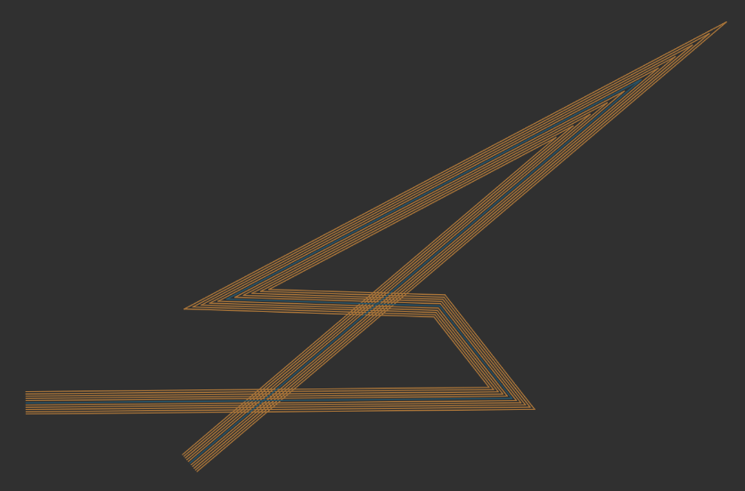

# penplot-stroke
A helper algorithm for pen plotting strokes with variable thicknesses
and properties based off a fixed pen tip size

## Usage

`createStroke(path, line_width, stroke_width, options)`

The input is a path in list form  
```js
const input_path = [ [x1, y1], [x2, y2], [x3, y3], ... ];
```
The output is a series of paths in list form like above
```js
const output_paths = [
  path1,
  path2,
  path3
];
```

The options are as follows with the default and all the posible options listed.
```js
options = {
  endcap : 'none', // square, triangle, inset
}
```

### Code Example

```js
// Include with ES 6
import createStroke from 'penplot-stroke';

// Include with Node's CJS
const createStroke = require('penplot-stroke');

// Include in Browser HTML
<script src="node_modules/penplot-stroke/build.js"></script>
    // creates the global 'createStroke'

// Set up parameters
const input_path = [ [1, 2], [5, 7], [3, 5] ];
const line_width = 4;    // The thickness you want the line to end up as
const pen_thickness = 1; // The thickness of each individual pen line

// Call the algorithm
const output_paths = createStroke(path, line_width, pen_thickness);
// > outputs 4 paths because you need 4 pen strokes to fill the line width of 1


// Specifying parameters to create a strike with
const rounded_paths = createStroke(path, line_width, pen_thickness, { endcap : 'round' });
```

This algorithm can also handle complete polygon paths. That is the polygon is
a path that has the first and last elements repeated. This algorithm will then
output a smooth path that is an inset and an outset of the polygon.  
The input path would then be of the form,
```js
const input_path = [ [x1, y1], [x2, y2], ..., [x1, y1]];
```

## Output
You can view a demo by downloading the source and opening 
[example.html](./example.html). In the mean time this is an example of what
the output is with a input pen thickness larger than the actual drawing
thickness of the strokes.



## Future Developments
I am looking to add some features in the future as I see fit.  
They are listed here in no particular order.  
+ Take an options argument to select particular features of the algorithm
+ Set input path as polygon 
  + Input polygon defined without repeated first and last vertex
+ Different styles of endcapes
  + Square (current default)
  + Rounded
  + Angled
+ Choose a fill direction
  + Expand (current default)
  + Inset
  + Outset

# Known Issues
As noted by [Darel Rex Finley](http://alienryderflex.com/polygon_inset/) which I
based my algorithm off of, two points which are near eachother (within the
distance of the line thickness) and at sharp angles produce unexpected behavior.
They offten shoot way off of the corner which is causing the issue.

# Release Notes

# 1.1.2
Added the ability to choose the endcap feature for a non-closed stroke.

# 1.1.1
The input path was left out of the output paths. Fixed the issue and made sure to
return the input path as well.

# 1.1.0
Added support for smooth polygon filling. Before this algorithm only supported
paths with two different endpoints. This caused artifects at the polygon
boundaries where the endpoints would both be square endcaps. This now supports
a complete inset and outset from a polygon loop.